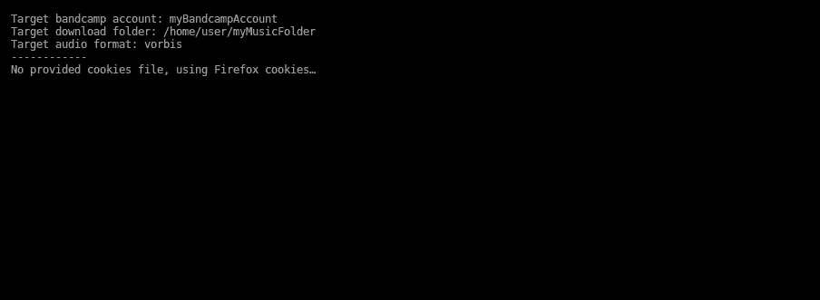

== Bandcamp collection downloader

A command-line tool to automatically download all releases purchased with a Bandcamp account.

```
$ java -jar ./bandcamp-collection-downloader.jar -d myMusicFolder myBandcampAccount
```



....

Usage: <main class> [-ehv] [-c=<pathToCookiesFile>] [-d=<pathToDownloadFolder>] [-f=<audioFormat>] [-j=<jobs>] [-r=<retries>]
                    [-t=<timeout>] <bandcampUser>
      <bandcampUser>        The bandcamp user account from which all releases must be downloaded.
  -c, --cookies-file=<pathToCookiesFile>
                            A file containing valid bandcamp credential cookies.
                            The file must either be obtained using the Firefox extension "Cookie Quick Manager" (https://addons.
                              mozilla.org/en-US/firefox/addon/cookie-quick-manager/) or using the Chrome extension "cookies.txt"
                              (https://chrome.google.com/webstore/detail/cookiestxt/njabckikapfpffapmjgojcnbfjonfjfg).
                            If no cookies file is provided, cookies from the local Firefox installation are used (Windows and Linux).
  -d, --download-folder=<pathToDownloadFolder>
                            The folder in which downloaded releases must be extracted.
                            The following structure is considered: <pathToDownloadFolder>/<artist>/<year> - <release>.
                            (default: current folder)
  -e, --skip-failed-releases
                            Skip releases that fail to download after the specified number of retries.
  -f, --audio-format=<audioFormat>
                            The chosen audio format of the files to download (default: vorbis).
                            Possible values: flac, wav, aac-hi, mp3-320, aiff-lossless, vorbis, mp3-v0, alac.
  -h, --help                Display this help message.
  -j, --jobs=<jobs>         Amount of parallel jobs (threads) to use (default: 4).
  -r, --retries=<retries>   Amount of retries for each HTTP connection (default: 3).
  -t, --timeout=<timeout>   Timeout in ms before giving up an HTTP connection (default: 50000).
  -v, --version             Display the version and exits.
....

=== Bandcamp authentication

This tool does not manage authentication with Bandcamp servers, as they require a valid token from Google Captcha. Hence, authentication must first be achieved using Firefox. Then there are two possibilities:

- If running a Windows or Linux system (and if the `--cookies-file` parameter is not used), then the tool will automatically find the required cookies in the Firefox profile folder of the system user. *This approach is now incompatible with versions of Firefox prior to 74.0*.
- Else, Bandcamp cookies must be exported in JSON using the Firefox Addon https://addons.mozilla.org/en-US/firefox/addon/cookie-quick-manager/[Cookie Quick Manager] or in text format with this Chrome Addon https://chrome.google.com/webstore/detail/cookiestxt/njabckikapfpffapmjgojcnbfjonfjfg?hl=en[cookies.txt].  The output, either txt from cookies.txt or JSON from Cookie Quick Manager, can then be used using the parameter `--cookies-file`

=== Usage

Example of command:

[source,dtd]
----
$ java -jar bandcamp-collection-downloader.jar --cookies-file=cookies.json --download-folder=~/Music myBandcampIdentifier
----

This will download all albums ever bought by the Bandcamp account _myBandcampIdentifier_, and extract the music in the folder `~/Music`, The tool always creates one folder per artist, each containing one folder per album (with the format `<year> - <album name>`).

After downloading the first album, it will create a `bandcamp-collection-downloader.cache` file in the chosen download folder. This allows the tool to remembers which albums have already been successfully downloaded, and thus prevents unnecessarily hitting the Bandcamp servers.

=== Compiling

The tool is written in Kotlin and compilation is handled by Gradle. A Gradle task named `fatJar` is available to build a standalone executable jar with all dependencies:

....
$ git clone https://framagit.org/Gwendal/bandcamp-collection-downloader.git
$ cd bandcamp-collection-downloader
$ gradle fatjar
....

The resulting binary can then be found in `build/libs/bandcamp-collection-downloader.jar`.

=== Dependencies

This tool relies on the following libraries:

- https://jsoup.org/[jsoup] to get and parse HTML,
- https://github.com/zeroturnaround/zt-zip[zt-zip] to unzip downloaded albums,
- https://picocli.info/[picocli] to provide a fancy CLI,
- https://github.com/google/gson[Gson] to parse JSON files,
- http://ini4j.sourceforge.net/[[ini4j]] to parse INI files,
- https://github.com/xerial/sqlite-jdbc[sqlite-jdbc] to read SQLite files.
